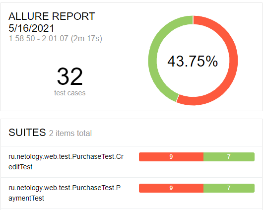

## Отчёт по итогам тестирования

###    Краткое описание

В ходе автоматизированного тестирования комплексного сервиса покупки тура были реализованы 
позитивные и негативные сценарии заполнения и отправки формы оплаты дебетовой банковской картой
и выдача кредита по данным карты. 

Протестирована поддержка двух СУБД (MySQL, PostgreSQL), корректность внесения приложением информации.

###  Тест-кейсы:
* Общее количество - 32;
* Успешных - 14 (43,75%);
* Неуспешных - 18 (56,25%);

По итогам тестирования заведены следующие issues:

* [При отправке формы с невалидным именем владельца карты появляется сообщение об успешной оплате.](https://github.com/EliseevG787/qa-diploma/issues/1)
* [При отправке формы с номером заблокированной карты появляется сообщение об успешной оплате.](https://github.com/EliseevG787/qa-diploma/issues/2)
* [При отправке формы с пустым полем «CVC/CVV» появляется красная подсветка с ошибкой полей «CVC/CVV» и «Владелец».](https://github.com/EliseevG787/qa-diploma/issues/3)
* [Красная подсветка не снимается с полей при повторной отправке формы с исправленными значениями.](https://github.com/EliseevG787/qa-diploma/issues/4)
* [Орфографическая ошибка в слове Марракеш.](https://github.com/EliseevG787/qa-diploma/issues/6)
* [Сумма тура не соответствует сумме трансакции.](https://github.com/EliseevG787/qa-diploma/issues/7)
* [При отправке формы с пустым полем «Номер карты» текст красной подсветки не соответствует ошибке.](https://github.com/EliseevG787/qa-diploma/issues/8)
* [При отправке формы с пустым полем «Месяц» текст красной подсветки не соответствует ошибке. ](https://github.com/EliseevG787/qa-diploma/issues/9)
* [При отправке формы с пустым полем «Год» текст красной подсветки не соответствует ошибке.](https://github.com/EliseevG787/qa-diploma/issues/10)
* [При отправке формы с невалидными данными не появляется красная подсветка с ошибкой у полей «Месяц», «Год» и «Владелец».](https://github.com/EliseevG787/qa-diploma/issues/11)
* [Заголовок страницы не соответствует содержанию.](https://github.com/EliseevG787/qa-diploma/issues/12)
* [Некорректное внесение приложением информации в базу данных при покупке в кредит](https://github.com/EliseevG787/qa-diploma/issues/13)

### Общие рекомендации
* На странице покупки разместить более подробную информацию о туре.
* Реализовать валидацию поля "Владелец".
  В поле "Владелец" добавить пояснение о вводе имени символами латинского алфавита, сделав невозможным
  ввод других символов.
* Выделять цветом активную кнопку "Купить" или "Купить в кредит".  
* Создать спецификацию для приложения.
